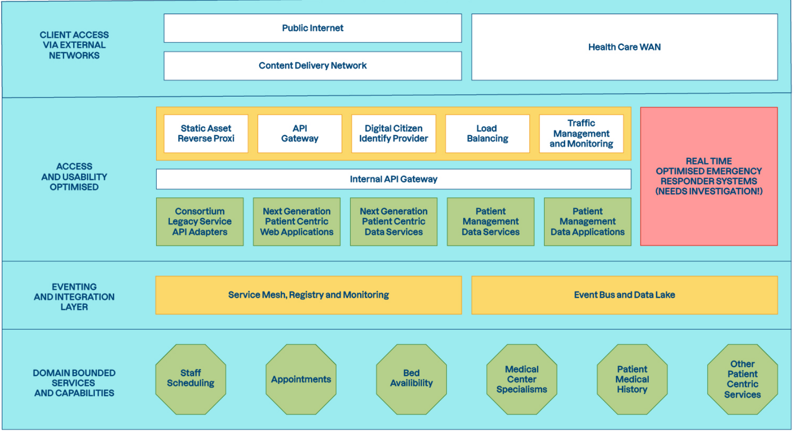

# Déclaration des travaux d’architecture

## Déclaration des travaux d'architecture

| Information | Détail |
| :--- | :--- |
| **Projet** | Preuve de concept (l'allocation de lits d'hôpital pour les urgences) |
| **Client** | Consortium MedHead |

## Table des matières

## Demande de projet et contexte

### Demande spécifique

En fonction des risques identifiés pour le projet, le comité d’architecture a demandé une preuve de concept dont le but est d’évaluer la capacité du comité d’architecture à répondre aux besoins dans le cadre du système d’intervention d’urgence en temps réel.

### Alignement stratégique

Un prototype sera construit en vue de réduire le risque pour le système d'intervention d'urgence de l'architecture globale cible (MedHead) :

### Simplifications suggérées

La preuve de concept peut restreindre sa portée en se concentrant principalement sur la réponse aux préoccupations énoncées dans le document des exigences de la PoC.

Voici des exemples de simplifications potentielles :

- Utiliser uniquement des interfaces tampons ou des implémentations factices de systèmes auxiliaires ;
- Faire des hypothèses simplifiées sur les contracts de ces systèmes en aval
- Documenter les lacunes d’un prototype et un plan pour y remédier dans tout système résultant

## Approche architecturale

### Processus d’architecture

La méthode de développement de l'architecture TOGAF (ADM) définit les meilleures pratiques pour le développement de l'architecture. Cependant, toutes les phases ne sont pas nécessairement pertinentes pour chaque projet. Le tableau ci-dessous décritl'utilisation de l'ADM pour ce projet particulier.

| **Phase** | **Entrée/Sortie** | **Remarques** |
| --- | --- | --- |
| **Préliminaire** | Énoncé des travaux d’architecture |  |
| **A - Vision de l’architecture** | Énoncé des travaux d’architecture | La vision est consolidée dans les objectifs du document de définition de l'architecture et du document des exigences de la PoC |
| **B - Architecture métier** | **Énoncé** des travaux d’architecture; Principes d’architectures; **Document** de définition de l’architecture; **Document** des exigences pour le déveoppement de la preuve de concept | En parallèle avec C et D : Opère dans le domaine des interventions d'urgence et de l'attribution de lits |
| **C - Architecture des systèmes d’information** | **Données** de références pour les spécialités NHS; **Document** de définition de l’architecture; **Document** des exigences pour le développement de la preuve de concept | En parallèle avec B et D : Opère dans le domaine des interventions d'urgence et de l'attribution de lits, vise à adhérer aux Principes d’architecture appropriés |
| **D - Architecture technologique** | **Document** de définition de l’architecture; **Document** des exigences pour le développement de la preuve de concept | En parallèle avec B et C |
| **E - Opportunités et solutions** | Bloc de construction de la solution (SBB) | Définition des SBB permettant la mise en oeuvre de la preuve de concept |
| **F - Planification de la migration** | **Feuille** de route; **Documentation** de la mise en oeuvre d’un pipeline de déploiement | **Focus** sur l’écart entre la PoC et son adaptation en production; **Mise en œuvre** d’une réponse aux considérations de construction d’un pipeline de déploiement CI/CD |
| **G - Gouvernance de la mise en oeuvre** | Évaluation de la conformité | **Démonstration** de la conformité de la preuve de concept avec les principes architecturaux métiers et techniques et avec les exigences formalisées de la preuve de concept. |
| **H - Gestion du changement d’architecture** |  | Les mises à jour d'architecture sont autorisées et doivent être documentées par le biais d'un historique d'approbation des modifications des composants architecturaux et autres artéfacts. |

Ce premier cycle établira une base de référence pour l'approche utilisée avec les preuves de concept. Les enseignements peuvent être partagés par le biais de la documentation produite

### Contenu de l’architecture

Le cadre ACF (Architecture Content Framework) TOGAF fournit une catégorisation des meilleures pratiques du contenu de l'architecture. Cependant, tous les éléments ne sont pas également pertinents pour chaque projet. Le tableau ci-dessous décrit les domaines de contenu pertinents pour ce projet particulier.

| Zone de contenu | Remarques |
| --- | --- |
| **Principes, vision et exigences de l’architecture** | Définit à travers les Principes d'architecture, le Document de définition de l'architecture et les exigences pour le développement de la preuve de concept |
| **Architecture métier** | Voir le modèle du domaine de haut niveau dans le Document de définition de l'architecture |
| **Architecture des systèmes d’information - Données** | **Mettez à jour** cet énoncé des travaux si nécessaire; **Voir le Document** de définition de l'architecture; **Le comité d'architecture** recommande une approche basée sur les données. |
| **Architecture des systèmes d’information - Applications** | **Mettez à jour** cet énoncé des travaux si nécessaire; **Voir le Document** de définition de l'architecture et le document des exigences de la preuve de concept |
| **Architecture Technologique** | **Mettez à jour** cet énoncé des travaux si nécessaire; **Voir le Document** de définition de l'architecture et le document des exigences de la preuve de concept; **Une modélisation** de l’architecture technologique de la preuve de concept mériterait d’être ajoutée. |
| **Réalisation de l’architecture** | **Projet logiciel complet** avec l’interface et l’API fonctionnelle, éprouvée en utilisant de solides principes d'ingénierie et de test. **Documentation du code/projet** fournit dans le répertoire |

Les préoccupations des principales parties prenantes doivent être prises en compte et être prioritaires, en particulier en ce qui concerne les temps de réponse, l'évolutivité, la tolérance aux pannes des systèmes hospitaliers auxiliaires et la résilience sous charge

## Méthodologies pertinentes et normes du secteur

Voir le document Principes d'architecture pour les principes spécifiques pour les preuves de concepts.

## Prise en charge du continuum des entreprises et des solutions

Dans la mesure du possible, la PoC devrait fournir ou faciliter la création de modules de construction (Solution Building Blocks) pour l'architecture et la solution.

Plus précisément, nous souhaitons que la PoC fournisse :

- Une stratégie de test pour la validation de principe ;
- La réalisation d'un pipeline CI/CD (même rudimentaire) qui pourra être utilisée
pour d'autres projets.

## Livrables de travail

- Une implémentation, des tests et la documentation associée ;
- Les rapports d'exécution des tests produits pendant l'intégration continue afin de
démontrer les comportements livrés ;
- Une présentation de la PoC, détaillant le comportement pris en charge, les
connaissances acquises et les recommandations futures

## Critères et procédures d’acceptation

Ils seront définis ultérieurement de manière appropriée en ligne avec les principes d'architecture, le document définissant les exigences pour le développement de la preuve de concept et le résultat d’une preuve de concept

## Approbation

Kara Trace, membre du conseil d'administration de MedHead et du comité d’architecture
