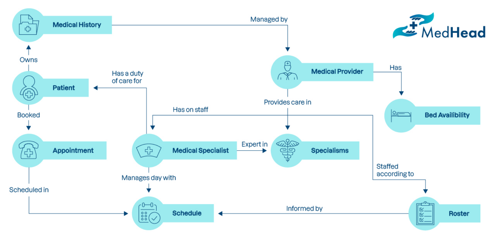
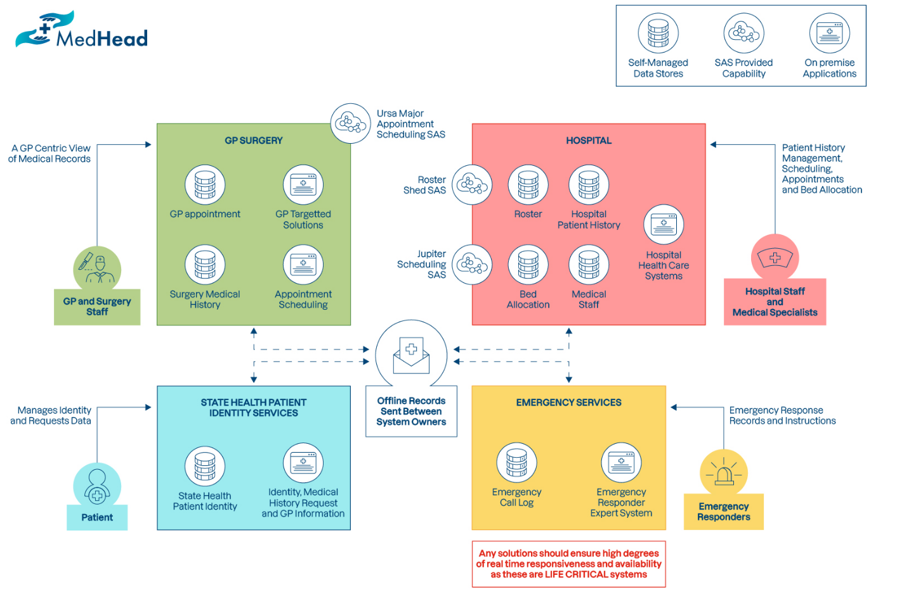
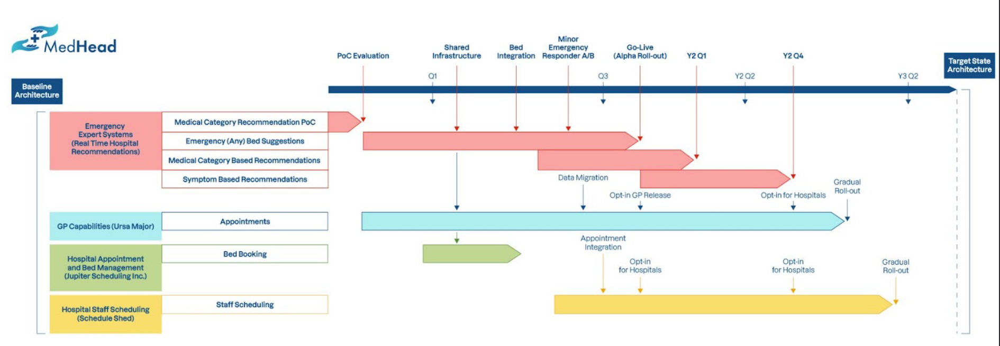
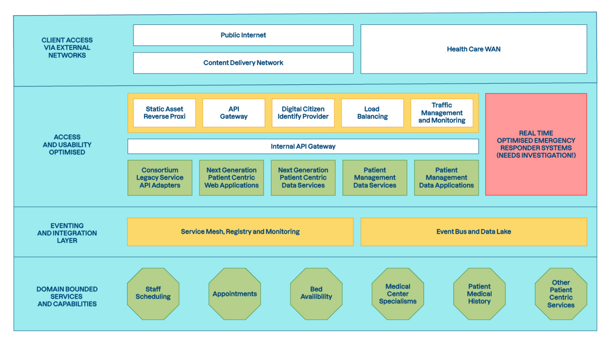
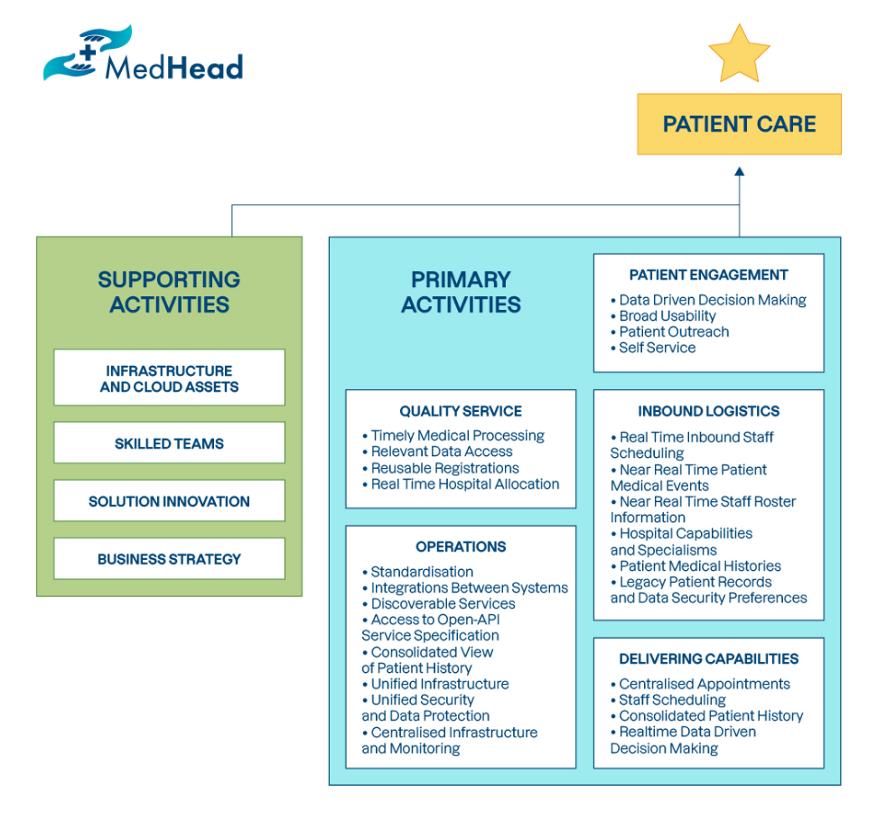

### Sommaire

- [Objectif du document](#objectif-du-document)
- [Public cible](#public-cible)
- [Contexte métier et parties prenantes clés](#contexte-métier-et-parties-prenantes-clés)
  - [Interlocuteurs](#interlocuteurs)
- [Objectifs et contraintes du projet](#objectifs-et-contraintes-du-projet)
  - [Objectifs](#objectifs)
  - [Contraintes](#contraintes)
  - [Limites](#limites)
  - [Limites du domaine](#limites-du-domaine)
  - [Contextes limités](#contextes-limités)
- [Principes architecturaux](#principes-architecturaux)
- [Architecture de base](#architecture-de-base)
- [Architecture cible](#architecture-cible)
- [Analyse de l’écart](#analyse-de-lécart)
- [Lacunes identifiées](#lacunes-identifiées)
  - [Pré-réservation d'un hôpital national pour intervention d'urgence](#pré-réservation-dun-hôpital-national-pour-intervention-durgence)
  - [Tri selon les symptômes pour intervention d'urgence](#tri-selon-les-symptômes-pour-intervention-durgence)
  - [Gestion des médicaments hospitaliers](#gestion-des-médicaments-hospitaliers)
- [Risques](#risques)
- [Annexes](#annexes)
  - [Annexe 1 : Support aux patients](#annexe-1--support-aux-patients)

## Objectif du document

Le document de définition de l'architecture est le livrable définissant les principaux artéfacts architecturaux créés au cours du projet. Il couvre tous les domaines de l'architecture (métier, données, application et technologie) et examine également tous les états pertinents de l'architecture (ligne de base, état(s) intermédiaire(s) et cible).

## Public cible

Ce livrable est destiné à toutes les personnes impliquées dans le projet. Il est particulièrement utile au comité d’architecture et aux parties prenantes liées à la réalisation du projet.

## Contexte métier et parties prenantes clés

Un consortium de quatre sociétés de premier plan s'est réuni pour consolider les efforts, les données, les applications et les feuilles de route de chacune afin de développer une plateforme de nouvelle génération centrée sur le patient et capable d'améliorer les soins de base proposés, tout en étant réactive, opérationnelle en temps réel et capable de prendre des décisions dans les situations d'urgence, en prenant en compte l’ensemble des données.

Les organisations suivantes apportent des données spécialisées et une expertise centrée sur le patient dans chacun des domaines ci-dessous.

| **Organisation** | **Domaine spécialisé** | **Motivations métier** | **Remarques** |
| --- | --- | --- | --- |
| Ursa Major Health | Planification de rendez-vous pour la médecine générale (GP) | Amélioration des processus de travail dans le cadre de l'intégration manuelle avec d'autres systèmes. | Consolidation des rendez-vous et réduction des problèmes d'intégration avec les systèmes de prise de rendez-vous hospitaliers. |
| Jupiter Scheduling | Prise de rendez-vous à l'hôpital | Amélioration des processus de travail dans le cadre de l'intégration manuelle avec d'autres systèmes. | Synergie avec d'autres systèmes de prise de rendez-vous et suppression des intégrations manuelles avec les systèmes de planification GP. |
| Emergency Expert Systems | Recommandations de l'hôpital en temps réel en fonction de la disponibilité des lits | Intégration et validation des données requises pour améliorer les décisions. | Réduire le taux de mauvaises recommandations en pondérant les décisions en fonction des antécédents médicaux connus des patients. |
| Schedule Shack (désormais Schedule Shed) | Liste du personnel médical et planification | Amélioration des processus de travail. | Dépend actuellement de mises à jour manuelles peu fiables des systèmes de prise de rendez-vous lorsque le personnel n'est pas disponible. |

Toutes les parties prenantes souhaitent réduire les doublons au niveau des fonctions actuelles, tout en développant de nouvelles fonctionnalités susceptibles d'améliorer les soins dispensés aux patients grâce à une meilleure intégration et un partage des données entre les systèmes.

**L'objectif principal du projet est de développer une plateforme de services dont les composants communiquent grâce à des événements.** Ces services ont une responsabilité unique. Ils sont également découplés entre eux et tolérants aux pannes. En résumé, ils respectent les principes d'une architecture de microservices distribués.

### Interlocuteurs

| **Interolocuteurs** | **Rôle et organisation** | **Résultats** |
| --- | --- | --- |
| Kara Trace | CIO, Ursa Major Health | *Intégration des systèmes de médecine générale en temps quasi réel avec des prestataires de soins de santé.* |
| Anika Hansen | PDG, Jupiter Scheduling Inc | *Architecture de domaine consolidée avec des événements sécurisés circulant en temps réel entre les systèmes* |
| Équipe d'intégration des systèmes de santé du Royaume-Uni | Emergency Expert Systems | Enrichissement des données et accès aux données anonymisées des hôpitaux et des patients. |
| Chris Pike | Architecte métier principal, Schedule Shed | Réductions de pannes. Flux d'événements normalisés et infrastructure de sécurité pour réduire la responsabilité de l’organisation causée par des erreurs de planification. |

## Objectifs et contraintes du projet

### Objectifs

L'objectif final, à savoir améliorer les soins dispensés aux patients, sera atteint grâce au consortium en combinant les forces de chacun pour créer les bases d'une plateforme partagée soutenue par des équipes compétentes dans le domaine des soins aux patients.

À son tour, cela soutiendra l'innovation des solutions centrées sur le patient, conformément à la stratégie métier visant à améliorer la qualité globale des soins. Ce socle devrait permettre au consortium de fournir de meilleurs soins aux patients au moyen des activités quotidiennes clés (voir annexe 1).

### Contraintes

- Les systèmes et processus existants ne doivent pas être significativement entravés pendant les phases du projet.
- La feuille de route architecturale et les orientations alimentant les exigences fonctionnelles doivent respecter le Cadre des normes numériques et technologiques du NHS.
- Les données réelles des patients doivent à tout moment rester conformes aux réglementations européennes, notamment le RGPD.
- Les phases initiales du projet devraient viser la création de :
  - modules de construction réutilisables qui respectent les meilleures pratiques convenues ;
  - ou de modèles pour des modules de construction futurs qui respectent les meilleures pratiques convenues.

### Limites

- Le niveau de conformité peut être assoupli pour les prototypes.
- La confidentialité des données des patients doit être respectée et tous les
prototypes non conformes à la production doivent anonymiser les données ou
utiliser des données factices.

### Limites du domaine

L’orientation architecturale se limite aux solutions, processus et systèmes affectant le modèle de domaine suivant, qui a été choisi par des experts en la matière impliqués dans le projet

### Contextes limités

- ***Informations sur le patient***: intervenant principal et identité d'un patient
- ***Information sur le spécialiste médical*** : intervenant principal et identité du responsable de la prestation des soins aux patients. Par exemple : un médecin, une infirmière ou un physiothérapeute.
- ***Gestion des prestataires médicaux*** : organisation chargée de fournir une gamme de soins de santé à un patient, par le biais de médecins spécialistes affiliés.
- ***Gestion des spécialités*** : capacités médicales fournies par les médecins spécialistes au prestataire.
- ***Planification de la gestion des informations*** : programmation médicale à court et à long terme des activités quotidiennes et de la disponibilité.
- ***Gestion des rendez-vous*** : prise de rendez-vous convenus entre le patient et le médecin spécialiste.
- ***Gestion du registre*** : plan prévisionnel de dotation du personnel dans un proche avenir par un prestataire médical.
- ***Gestion des données sur les antécédents médicaux des patients*** : données détenues par les patients et gérées par les centres médicaux.

## Principes architecturaux

L'architecture doit être construite selon ce qui est énoncé dans le document [Principes de l'architecture](02-Architecture-Principles.md).

Notez que ces principes sont assouplis pour les validations de principes et les mises en œuvre destinées à l'apprentissage.

## Architecture de base

L'architecture de base se compose de systèmes disparates selon les cas d'utilisation et les contextes médicaux spécifiques :

- Chirurgie (médecine générale) ;
- Hôpitaux ;
- Intervenants d'urgence ;
- Systèmes de gestion de l'identité médicale gérés par l'État.

Un aperçu de l'architecture est disponible ci-dessous :

- La séparation des systèmes et le processus manuel important impliqué dans la synchronisation des informations pertinentes entre les systèmes ne parviennent manifestement pas à fournir une assistance en temps réel aux services d'urgence afin de faciliter les échanges entre les hôpitaux pour :
  - attribuer un cas spécifique à l’établissement de soins approprié ;
  - éviter que les équipes soient débordées dans un hôpital donné.
- Dans les cas qui nécessitent plusieurs hôpitaux, le système doit déterminer où les ambulances doivent se rendre, en fonction de la distance, des besoins en soins et de la disponibilité du personnel.

## Architecture cible

Ce projet possède une gouvernance architecturale commune au sein du consortium, par le biais d'un groupe de gestion de la plateforme et des systèmes détenus conjointement

Cette gouvernance, assurée par le comité d’architecture, a pour but de réaliser des économies d'échelle et de respecter une feuille de route stratégique pour la livraison d'une plateforme qui offre aux membres du consortium à la fois une agilité et une mise sur le marché plus rapide, avec des niveaux de sécurité des données et de tolérance aux pannes exigés de la part des institutions du secteur de la santé.

Ce qui suit décrit la feuille de route actuelle du consortium MedHead, partant de l'architecture métier existante pour aboutir à l'architecture cible finale.

L'architecture cible est divisée en quatre niveaux :

- **Accès client via des réseaux externes**
  - Les clients externes utilisés par les patients et le personnel médical accèdent à la plateforme via cette couche. Ce niveau comprend les routages physiques et logiques pour accéder numériquement à la plateforme MedHead. Des contenus à faible risque et souvent renouvelés peuvent être disponibles via les réseaux de diffusion de contenu (CDN) approuvés par le projet.
- **Couche optimisée pour l'accès et l'utilisation**
  - Ce niveau fournit des applications et des services hautement optimisés pour l'accès aux données et leur utilisation par les patients et le personnel médical. Les systèmes devraient être découplés et inclure une tolérance aux pannes en suivant un modèle de microservice avec le pattern Database per service.
  - Il contient également les systèmes d'intervention d'urgence optimisés en temps réel : les systèmes hautement optimisés pour des cas d'utilisation en temps réel et des niveaux élevés de tolérance aux pannes seront hébergés dans cette couche. Ce sont des systèmes critiques pour la sécurité des patients. Le projet nécessite une validation anticipée du modèle et des modules de construction de solution pouvant être utilisés pour développer des systèmes hautement réactifs.
- **Couche d'événements et d'intégration**
  - **Maillage de services** : Les fonctions et services métiers de base seront accessibles via une mise en œuvre de type maillage de services dans la couche d'intégration. Cela fournira également l'observabilité par le biais de modèles « side-car proxy » et de découverte des services.
  - **Bus d'événements et lac de données** : Tous les services devront publier les principaux événements métier sur un bus d'événements commun, ce qui entraînera également l’agrégation des événements dans un lac de données à accès optimisé. Le lac de données est destiné à permettre aux applications de reconstruire les magasins de données en fonction de l'historique des applications. Le lac de données est destiné à assister les systèmes en temps réel (entre autres) afin qu’ils fournissent des comportements réactifs au changement
- **Services et capacités limités au domaine**
  - Ce niveau contient les services métier de base séparés par des contextes opérationnels et liés au domaine. Les systèmes de cette couche doivent suivre un modèle d’architecture hexagonal/ports et adaptateurs et être construits pour des interfaces et des abstractions qui les rendent faciles à modifier selon les nouvelles tendances et besoins métiers.

Notez que l'objectif de ce projet est de migrer progressivement les capacités existantes et nouvelles des silos des organisations membres vers une architecture cohérente qui appartient conjointement au groupe de gestion de la plateforme et des systèmes et adhère à son architecture, ses principes et ses normes.

## Analyse de l’écart

Le tableau ci-dessous compare les fonctions connues de la plateforme DE BASE et l'architecture cible prévue. L’intersection entre une ligne et colonne peut contenir l’une de ces deux valeurs, consolidé ou éliminé, selon que l’architecture cible renforce ou supprime une fonctionnalité présente dans l’architecture de base. Remarquez que les fonctionnalités supprimées ont été regroupées à droite du tableau dans la colonne “Fonctionnalité éliminée”. Une intersection sans indication signifie que la fonctionnalité de l’architecture de base est conservée.

|  | Fronctionnalités de l’architecture CIBLE | Historique du centre médical | Prise de rendez-vous | Planification du personnel | Attribution des lits | INTERVENTION D’URGENCE fondée sur les données | Fonctionnalités de l’architecture de base éliminée |
| --- | --- | --- | --- | --- | --- | --- | --- |
| Fonctionnalités de l’architecture de BASE |  |  |  |  |  |  |  |
| Pré-réservation d’hôtel de l’hôpital local pour intervention d’urgence* |  |  |  |  |  |  |  |
| Pré-réservation d’un hôpital pour intervention d’urgence   |  |  |  |  |  |  | Absent au niveau national |
| Accès aux données d’historique - Médecine générale |  | Consolidé |  |  |  |  | Absent |
| Rendez-vous Médecine générale |  |  | Consolidé |  |  |  |  |
| Planification des médecins spécialistes de l’hôpital  |  |  |  | Consolidé |  |  |  |
| Disponibilité des lits d’hôpital  |  |  |  |  | Consolidé |  |  |
| Gestion des médicaments hospitaliers |  |  |  |  |  |  |  |
|  |  |  |  |  |  |  | Absent |

- - Jusqu'à 12 hôpitaux de 2 000 lits chacun
- ** Environ 2 000 hôpitaux au Royaume-Uni et environ 200 000 lits

## Lacunes identifiées

### Pré-réservation d'un hôpital national pour intervention d'urgence

Bien que le système actuel permette de rechercher des lits d'hôpital au niveau national, dans seulement 0,005 % des cas (source non disponible), les patients sont transportés hors du district considéré comme local pour répondre à l'urgence et prendre en charge l’intervention. Sur cette base, tout système devrait pouvoir inclure des extensions permettant cela (par exemple un modèle de prise en charge), or cela n'est pas requis dans le système initial.

### Tri selon les symptômes pour intervention d'urgence

Le système actuel utilise les symptômes et s'en sert pour déterminer la gravité de l'urgence.

Cela est actuellement considéré comme hors-projet et peut continuer à être assuré par les anciens systèmes

### Gestion des médicaments hospitaliers

Le système actuel permet de suivre les stocks de médicaments et de passer des commandes. Cela est considéré comme en dehors du cadre de ce projet par les parties prenantes et peut continuer d'être assuré à l'aide des anciens systèmes.

## Risques

Voir le registre des risques pour une ventilation des risques connus actuels.

Comme on peut le voir, la principale préoccupation des parties prenantes est actuellement le système d’intervention d’urgence en temps réel, notamment : sa capacité à fournir une allocation de lit en temps opportun, dans le service hospitalier approprié (voir les Données de référence sur les spécialités NHS)

Ces risques doivent être éliminés à l'aide d'une preuve de concept. Voir ci-dessous.

## Annexes

### Annexe 1 : Support aux patients

